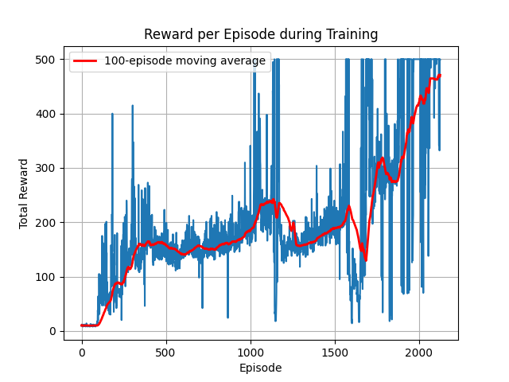

# CartPole-v1 Reinforcement Learning with Linear Function Approximation

A simple ε-greedy Q-learning agent for OpenAI Gym's CartPole-v1 environment, using random Fourier features (RBF kernels) to approximate the state–action value function. This implementation demonstrates how to:

- Gather state–action samples and fit a featurizer (RBF sampler)
- Learn a linear weight vector w via Q-learning
- Evaluate and visualize agent performance over training

---

## Table of Contents

1. [Features](#features)
2. [Dependencies](#dependencies)
3. [Installation](#installation)
4. [Usage](#usage)
   - [Training](#training)
   - [Testing](#testing)
   - [Visualization & Watching](#visualization--watching)
5. [Hyperparameters](#hyperparameters)
6. [Results](#results)

---

## Features

- Linear Q-learning using random Fourier features
- ε-greedy policy for balancing exploration vs. exploitation
- Automatic "environment solved" detection (average reward ≥ 475 over 100 episodes)
- Performance plotting with moving-average smoothing
- Interactive rendering of trained agent

---

## Dependencies

- Python 3.8+
- Gymnasium (CartPole-v1)
- NumPy
- Matplotlib
- scikit-learn

---

## Installation

1. Clone this repository:
   ```bash
   git clone https://github.com/omid-mohebi/cartpole-rl.git
   cd cartpole-rl
   ```

2. Create a virtual environment and install packages:
   ```bash
   python3 -m venv venv
   source venv/bin/activate
   pip install --upgrade pip
   pip install gymnasium numpy matplotlib scikit-learn
   ```

---

## Usage

### Training

Run the training loop, which:

1. Initializes the Model (fits RBF featurizer on gathered samples)
2. Performs Q-learning for N episodes
3. Stops early if the environment is solved

### Testing

After training, the agent can be tested on new episodes to evaluate performance.

### Visualization & Watching

After training completes, the script displays:

1. Reward-per-episode plot (with 100-episode moving average in red)
2. Live rendering of a single episode (press Ctrl+C to stop)

---

## Hyperparameters

| Parameter | Description | Default |
|-----------|-------------|---------|
| GAMMA | Discount factor for future rewards | 0.99 |
| ALPHA | Learning rate | 0.1 |
| ε (epsilon) | Exploration probability in ε-greedy policy | 0.1 |
| Episodes | Maximum number of training episodes | 2000 |
| RBF Features | Number of components in random Fourier features | (scikit-learn default) |

You can adjust these directly in the script or parameterize via command-line flags.

---

## Results

Typical training yields average rewards approaching 500 (solved) within ~1,000–2,000 episodes. The moving-average plot helps track convergence behavior.

